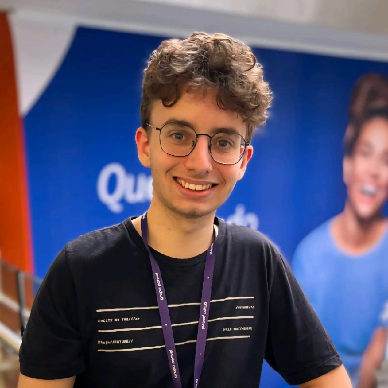

<html lang="pt-BR">
<head>
<meta charset="UTF-8">
<meta name="viewport" content="width=device-width, initial-scale=1.0">

<title>Lafin | Backend Engineer</title>

<link href="https://fonts.googleapis.com/css2?family=Poppins:wght@300;400;600;700&display=swap" rel="stylesheet">

</head>

<body>

<canvas id="bg"></canvas>

<section class="hero">

<h1>Felipe Lafin</h1>
<h3>Full Stack Developer JR</h3>

Java | C# | Spring Boot | Java Script | HTML | CSS | Angular | Typescript | Python | SQL | Studying React

<button class="btn" onclick="toggleMode()">Toggle Theme</button>

<a href="https://github.com/FelipeLafin">GitHub</a> |
<a href="https://www.linkedin.com/in/felipe-lafin-haushahn-3785a2237/">LinkedIn</a>

</section>

<h2>🚀 Sobre Mim</h2>

Sou estudante de Ciências da Computação e entusiasta da tecnologia. Estou no quinto semestre do curso e em constante aprendizado sobre programação e desenvolvimento.

Tenho facilidade em trabalhar em equipe, sou comunicativo, proativo, focado e sempre busco expandir minhas habilidades. Desde 2016, participo do movimento escoteiro, onde desenvolvi competências como liderança, organização e resiliência, aplicáveis tanto na vida pessoal quanto profissional.

Estou em busca de oportunidades para aplicar meu conhecimento e contribuir com entusiasmo para o sucesso de projetos e equipes.

Segue meu portfólio no github:
https://github.com/FelipeLafin

<h2>💼 Experiência</h2>

<h3>Grupo Panvel</h3>
<b>Estagiário - Atual</b>
<ul>
<li>APIs REST com Spring Boot</li>
<li>SQL</li>
<li>PostgreSQL</li>
<li>Metodologia Ágile</li>
<li>Java</li>
<li>Docker</li>
</ul>

<h3>Ifood</h3>
<b>Entregador - 2022/2024</b>
<ul>
<li>Comunicação com cliente</li>
</ul>

<h3>Villela Brasil Bank</h3>
<b>Desenvolvedor Full Stack JR</b>
<ul>
<li>C#</li>
<li>SQL</li>
<li>React</li>
<li>Metodologia Ágile</li>
<li>TypeScript</li>
<li>Angular</li>
<li>HTML</li>
<li>SCSS</li>
<li>JavaScript</li>
</ul>

<h2>📌 Projetos</h2>

<h3>Exercício de gestão de contas bancárias</h3>

Gestão de pedidos, usuários e cardápio.

<b>Stack:</b> Java • Spring Boot • PostgreSQL
  
<a href="https://github.com/FelipeLafin/gestao-contas-bancarias">Ver Projeto</a>

<h3>Software Cripto Market</h3>

Este aplicativo permite acompanhar o preço das criptomoedas mais importantes, simular o valor que seria recebido/pago baseado no valor em tempo real da criptomoeda selecionada e redirecionar o usuário para a aba de compra/venda no site oficial.

<b>Stack:</b> Python
  
<a href="https://github.com/FelipeLafin/Software_Cripto_Market">Ver Projeto</a>

<h3>Mais projetos:</h3>
<a href="https://github.com/FelipeLafin?tab=repositories">Ver mais projetos</a>

<h2>🧠 Skills</h2>
Java
C#
Spring Boot
SQL
Java Script
HTML
CSS
Angular
Typescript
Python
React

<h2>🎓 Educação</h2>

Faculdade: ATITUS Educação (Campus Mont Serra't)

Curso: Ciências da Computação - Bacharel

Semestre Atual: 5º

<footer>
© 2026 Felipe Lafin
</footer>

